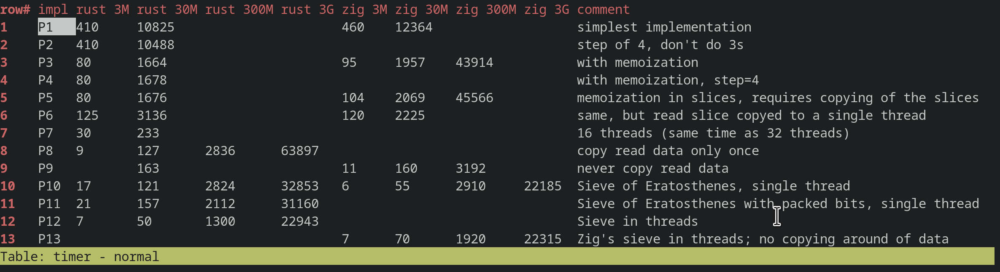

# parallel_primes

Parallelization of threads, and comparison of Rust vs Zig coding experience. This readme should be the same between the Zig and Rust projects.

Rust implementation: https://github.com/zrayx/parallel

Zig implementation: https://github.com/zrayx/parallel_primes_again

At the moment I wouldn't be able to decide which language to chose for a larger hobby project, both have pros and cons.

Zig pros:
* Legibility
  * Source code is very readable
* Much easier to implement code
* More fun to code in, not as much fighting the language
* Embedded programming actually viable
* Automatic conversion of integers if they fit the size (e.g. u32 -> i64)

Zig cons:
* Documentation
  * Still early work in progress
  * Being able to read the standard library and other people's code makes this much less of an issue as it seems at first
* Tool support
  * Couldn't get zls/debugging to work out of the box in vim or vs code.
* A bit slower than Rust in this test
* Language not yet stable
* Shadowing of variables not allowed

Performance
===========
Zig is a bit slower than Rust, although I think that this will be solved over time.

Overview shown in zspread (https://github.com/zrayx/zspread):

Notable implementations:

* P1 - naive implementation
* P3 - memoization
* P8/P9 - memoization, multiple threads
* P10 - Sieve of Eratosthenes, single thread
* P12/P13 - Sieve of Eratosthenes, many threads. Unfortunately doesn't scale in either Rust or Zig. I'm guessing that the memory is the bottleneck.
